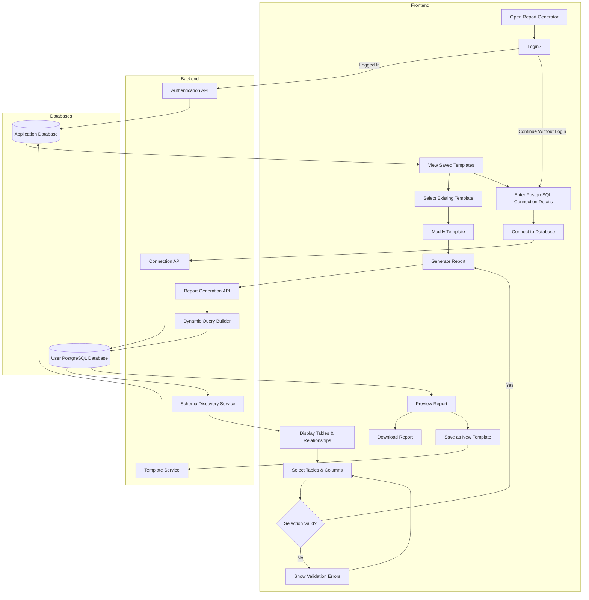

# 📊 GOreportGO

`GOreportGO` is a powerful, modern, and dynamic Web Application designed to connect to any external PostgreSQL database, discover its schema (tables, columns, types, primary keys, and foreign-key relationships) in real-time, and allow users to build and run complex reports dynamically without writing a single line of SQL.

Featuring a Go-powered backend query generator and a sleek, modern React frontend complete with smooth animations, dynamic filters, and schema visualization, the application makes complex database reporting simple and intuitive.

---

## 🌟 Key Features

- **Dynamic Database Connectivity**: Connect anonymously to any PostgreSQL database by providing a connection string (DSN) directly from the UI.
- **Auto Schema & Relationship Discovery**: Queries database metadata (`information_schema`) to map all tables, columns, data types, and foreign key relationships instantly.
- **Dynamic Query Builder**: A visual query construction interface supporting:
  - Table selection and column projection.
  - Multi-table joins automatically resolved using foreign keys.
  - Advanced filtration (`WHERE` clauses with customizable operators).
  - Sorting (`ORDER BY` options).
  - Grouping and aggregation (`GROUP BY` and `HAVING` filters).
- **Interactive Previews**: Instantly review SQL queries generated on the fly and preview execution results in an interactive table view.
- **Template Management**: Save report structures and connection setups as reusable JSON templates.
- **Premium User Experience**: Responsive layout with smooth scrolling (Locomotive Scroll), glassmorphic design aesthetics, and subtle page transitions.

---

## 🏗️ Architecture & System Flow

The diagram below illustrates the end-to-end user flow and data flow through the frontend client, backend REST services, and database layers.

### System Overview Diagram



### Flow Explanation
1. **Initiation & Connection**: The user starts by either logging in (to retrieve saved settings/templates from the application DB) or continuing anonymously. They enter connection details (DSN) to connect to their target PostgreSQL instance (`EXTDB`).
2. **Schema Mapping**: Upon a successful connection, the **Schema Discovery Service** queries the target database's catalog tables and constructs a graph of tables, datatypes, and relationship constraints, sending it back to the client for rendering.
3. **Report Configuration**: Users choose target tables/columns, adding filters or groups. The frontend validates the selection structure.
4. **Dynamic Query Execution**: The client sends the query configuration payload to the backend's **Dynamic Query Builder** (in [CreateQuery.go](file:///d:/BTECH/INTERN_BUSY/Projects/GoReportGeneration/backend/services/CreateQuery.go)), which generates a syntactically correct, sanitized SQL query. The backend executes this raw query on the user's database and streams the data back.
5. **Exporting and Reusing**: The user can preview the query's output, export/download it as a CSV, and save the report design template back to the main App Database.

---

## 🛠️ Technology Stack

- **Backend**:
  - **Golang**: High-performance core language.
  - **Gin Gonic**: Lightning-fast, minimalist HTTP web framework.
  - **GORM**: Object-Relational Mapper for dynamic database queries and meta-queries.
- **Frontend**:
  - **React (Vite)**: Modern fast build and compilation toolchain.
  - **Locomotive Scroll**: High-performance smooth scrolling effects.
  - **Tailwind CSS & Vanilla CSS**: Sophisticated layout rendering and clean styling.
  - **Axios**: Promised-based HTTP client for API interactions.

---

## 📂 Folder Structure

```filepath
GOreportGO/
├── backend/
│   ├── config/             # Database connection loading and context settings
│   ├── constants/          # Predefined database catalog SQL statements
│   ├── diagrams/           # Design models, flow diagrams, and assets
│   ├── handlers/           # HTTP controllers for handling requests (DSN, Schema, Query execution)
│   ├── routes/             # Gin endpoint definitions
│   ├── services/           # Schema mapping and dynamic query generator engines
│   ├── go.mod              # Backend dependencies
│   └── main.go             # Application entrypoint
└── frontend/
    ├── src/
    │   ├── api/            # Base Axios configurations
    │   ├── components/     # UI Elements (Mascots, SchemaViewer, Query builder forms, tables)
    │   ├── pages/          # Page layouts (ConnectPage, SchemaPage, ReportPage)
    │   ├── App.jsx         # Routing, Locomotive Scroll hookups, and app states
    │   ├── index.css       # Style sheets and typography config
    │   └── main.jsx        # React application bootstrap
    ├── package.json        # Frontend configuration and scripts
    └── vite.config.js      # Vite build configuration
```

---

## 🚀 Getting Started

### 📋 Prerequisites
- Install **Go (Golang)** (v1.20+)
- Install **Node.js** (v18+)
- Install a running instance of **PostgreSQL** database (for testing queries and templates)

### 🔧 Setup & Configuration

#### 1. Backend Setup
1. Navigate to the backend directory:
   ```bash
   cd backend
   ```
2. Create or edit a `.env` file in the `backend/` directory:
   ```env
   DSN="host=localhost port=5432 user=postgres password=YOUR_PASSWORD dbname=test sslmode=disable"
   PORT=8080
   VALID_URL="*"
   ```
3. Run the Go backend server:
   ```bash
   go run main.go
   ```
   The backend server should start running at `http://localhost:8080`.

#### 2. Frontend Setup
1. Navigate to the frontend directory:
   ```bash
   cd frontend
   ```
2. Install dependencies:
   ```bash
   npm install
   ```
3. Create or edit a `.env` file in the `frontend/` directory:
   ```env
   VITE_API_BASE_URL=http://localhost:8080
   ```
4. Start the frontend developer server:
   ```bash
   npm run dev
   ```
   The frontend UI will be served locally (usually at `http://localhost:5173`).

---

## 🧪 API Endpoints

| Method | Endpoint | Description |
| :--- | :--- | :--- |
| **POST** | `/api/v1/connDb` | Connect dynamically to database by passing connection parameters or DSN. Returns table schema. |
| **POST** | `/api/v1/disconnect` | Resets current database connection context on the backend. |
| **GET** | `/api/v1/getDets` | Retrieves schema info (tables, constraints, column metadata) for the connected database. |
| **POST** | `/api/v1/getData` | Accepts column selections, join conditions, and filters, returns dynamically compiled SQL and matching records. |

---

## ✍️ Author

- **ANKIT PANCHAL**
